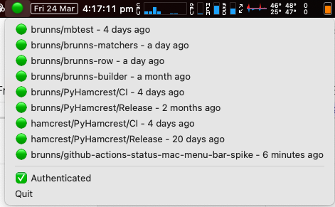

# GitHub Actions Status Mac Menu Bar Spike

Spike for a Mac menu bar app to display [GitHub actions](https://pinboard.in/u:brunns/t:github-actions) run status.

This is **very** much spike code - no tests, hard-coding everywhere, and the structure is all wrong. Kinda works, though.



## GitHub authentication

To run or build this application, you will need to register a
[GitHub OAuth app](https://docs.github.com/en/apps/oauth-apps/building-oauth-apps/creating-an-oauth-app), with Device
Flow enabled. The Client ID for this app should be stored in the `GITHUB_OAUTH_CLIENT_ID` environment variable before
running or building:

```shell
export GITHUB_OAUTH_CLIENT_ID="01234567890123456789"
```

The app will still work without this token, though private repositories will not be viewable, and the
[API rate limit](https://docs.github.com/en/rest/overview/resources-in-the-rest-api#rate-limiting) will be quite low
(and shared between all users on one IP address), meaning only a few repositories can be monitored and that the check
interval should not be set to be too frequent.

## CLI

To run from cli:

```shell
# If you're using pyenv, you'll need to use the system python for this. If not, I expect this is the default.
pyenv local system  
python3 -m venv .venv
source .venv/bin/activate
pip install -r requirements.txt --upgrade
python3 status.py -vvv
```

## App

To build as a .app bundle:

```shell
# If you're using pyenv, you'll need to use the system python for this. If not, I expect this is the default.
pyenv local system  
python3 -m venv .venv
source .venv/bin/activate
pip install -r requirements.txt --upgrade
python3 setup.py py2app  # .app will be found in the dist/ folder
ditto -c -k --sequesterRsrc --keepParent "dist/GitHub Actions Status.app" "dist/GitHub Actions Status.app.zip"
```

## Configuration

If running from the command line, configuration can be found in `./config.json`. When running as an app,
configuration will be found in `~/.github_actions_status/config.json` (which will be created on the first
run). Edit this file to specify repositories to monitor (with specific workflows if desired), the check interval (in 
seconds), and some logging details.

Thanks to [Freja Brunning](https://twitter.com/freja_brunning) for the icon.
