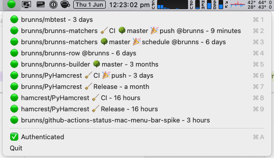

# GitHub Actions Status Mac Menu Bar Spike

Spike for a Mac menu bar app to display [GitHub actions](https://pinboard.in/u:brunns/t:github-actions) run status.

This is **very** much spike code - no tests, hard-coding everywhere, and the structure is all wrong. Kinda works, though.



## Optional tools

[`direnv`](https://direnv.net/) and [`xc` ](https://xcfile.dev/) are both optional.

```sh
brew tap joerdav/xc
brew install direnv xc
```

If you are using [`direnv`](https://direnv.net/), copy [`.envrc.template`](/.envrc.template) to `.envrc`, populate, and
`direnv allow` it. (If not, you'll need to create the environment variables from [`.envrc.template`](/.envrc.template)
some other way. The simplest might be to create `.envrc` as normal, and to manually run `source .envrc`.)

If you'd prefer not to use [`xc` ](https://xcfile.dev/) as a task runner, [all command line tasks are defined below](#Tasks) and can be run from the command line.

## GitHub authentication

To run or build this application, you will need to register a
[GitHub OAuth app](https://docs.github.com/en/apps/oauth-apps/building-oauth-apps/creating-an-oauth-app), with Device
Flow enabled. The Client ID for this app should be stored in the `GITHUB_OAUTH_CLIENT_ID` environment variable before
running or building:

```shell
export GITHUB_OAUTH_CLIENT_ID="01234567890123456789"
```

The app will still work without this token, though private repositories will not be viewable, and the
[API rate limit](https://docs.github.com/en/rest/overview/resources-in-the-rest-api#rate-limiting) will be quite low
(and shared between all users on one IP address), meaning only a few repositories can be monitored and that the check
interval should not be set to be too frequent.

## Tasks

### setup
One-time setup

Run: once
```sh
# If you're using pyenv, you'll need to use the system python for this. If not, I expect this is the default.
pyenv local system  
python3 -m venv .venv
```

### deps

Install or upgrade dependencies

Requires: setup
Run: once
```sh
source .venv/bin/activate
pip install -r requirements.txt --upgrade
````

### cli

Run from cli

Requires: deps
```sh 
source .venv/bin/activate
python3 status.py -vvv
```

### build

Build as an .app bundle and zip

Requires: deps
```sh 
python3 setup.py py2app --arch universal2  # .app will be found in the dist/ folder
ditto -c -k --sequesterRsrc --keepParent "dist/GitHub Actions Status.app" "dist/GitHub Actions Status.app.zip"
```

## Configuration

If running from the command line, configuration can be found in `./config.json`. When running as an app,
configuration will be found in `~/.github_actions_status/config.json` (which will be created on the first
run). Edit this file to specify repositories to monitor (with specific workflows if desired), the check interval (in 
seconds), and some logging details.

Thanks to [Freja Brunning](https://twitter.com/freja_brunning) for the icon.
