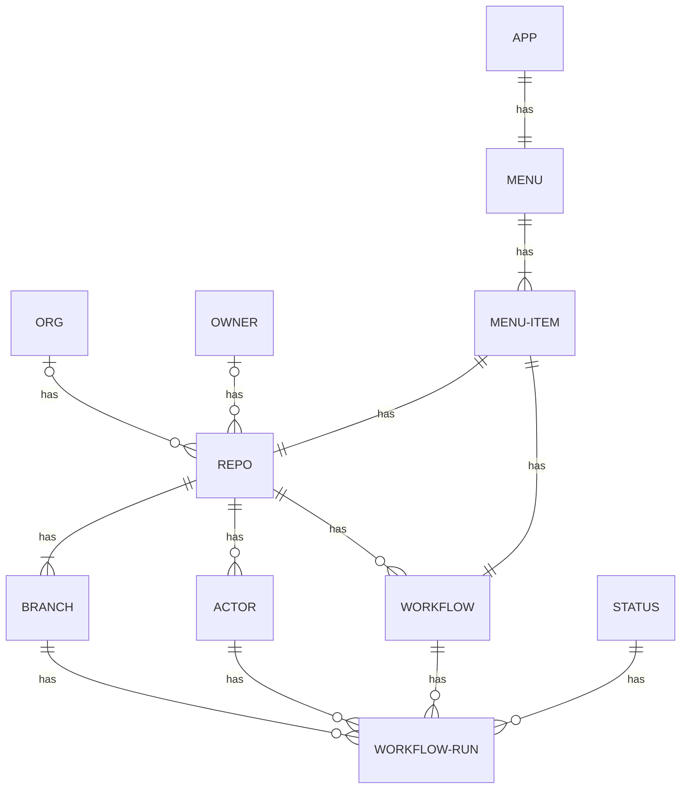

# TO DO

I probably won't do many of these here - this is just a spike after all - but a real implementation needs these.

* ~~[OAuth2 authentication](https://docs.github.com/en/developers/apps/authorizing-oauth-apps#device-flow), both so we don't hit API rate limits, and so we can see private repos. See [OAuth2 links](https://pinboard.in/u:brunns/t:oauth2).~~
* ~~Use py2app as per [Creating macOS Apps from Python Code](https://camillovisini.com/article/create-macos-menu-bar-app-pomodoro/#creating-macos-apps-from-python-code).~~
    * ~~How to find config file if in app mode?~~
    * ~~Make the logs available when running as an app~~
    * [Distributable app creation](https://blog.glyph.im/2023/03/py-mac-app-for-real.html)
* Better structure - much better. (Based on domain model - see below.)
* ~~Configurability - repos to check, check interval.~~
    * (Including eventually a preferences UI perhaps - but a config file will do to start with).
* ~~Deal with multiple workflows per repo.~~
* Pause/restart app.
* ~~Trigger workflow runs?~~
* ~~What's up with the threads hanging?~~ (Might be fixed?)
* ~~requests -> [httpx](https://www.python-httpx.org/)~~
* ~~furl -> [yarl](https://pypi.org/project/yarl/)~~
* ~~Display better error message if config broken.~~
* Move default config location from `~/.github_actions_status/` to `~/.local/github_actions_status/`

## To-be structure

Separate presentation, domain, and API layers.

